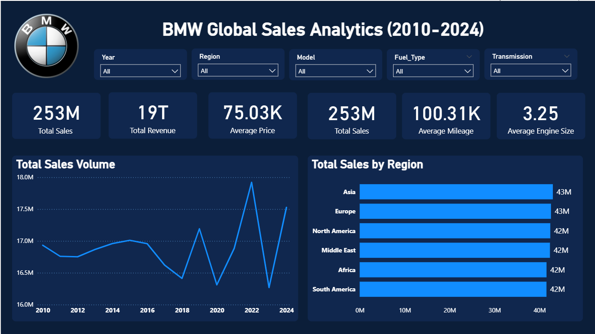
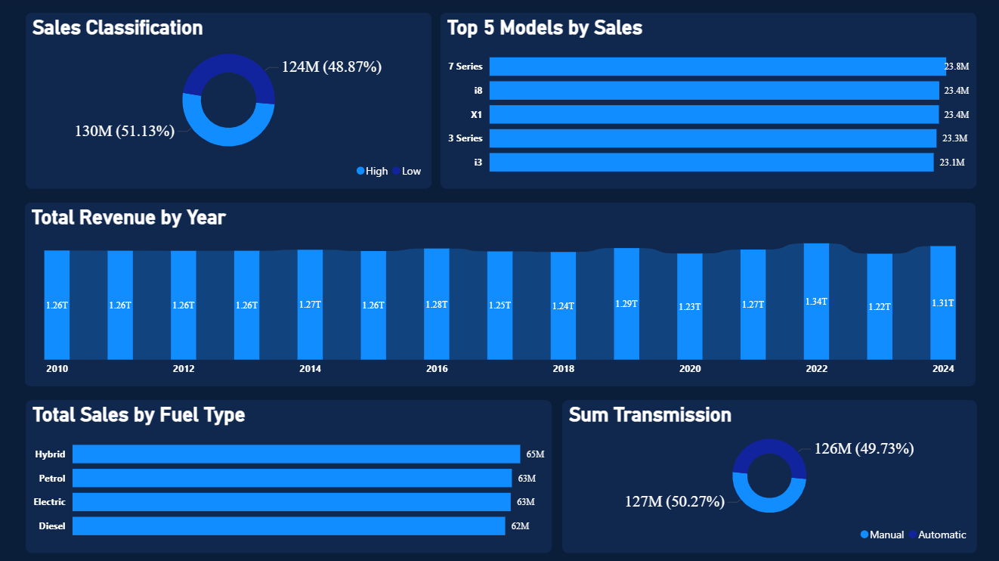
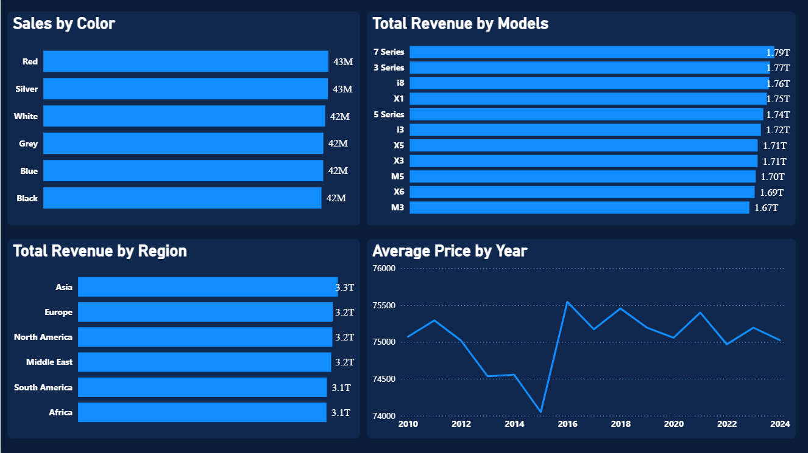

# 🚗 BMW Global Sales Analytics (2010–2024) – Power BI Project

This repository showcases a complete **end-to-end Power BI data analytics project** analyzing **BMW’s global sales performance from 2010 to 2024**.  
The goal was to extract **meaningful business insights**, understand market behavior, and support **data-driven decision-making** for premium automotive strategy.

---

## 📊 Project Overview

This project provides a comprehensive analysis of BMW’s performance across:

- Global sales trends  
- Regional performance  
- Model-wise revenue  
- Pricing behavior  
- Fuel type preferences  
- Transmission demand  
- Market segmentation  
- Customer color preferences  

The dashboard is divided into **3 pages**:
1. Executive Overview  
2. Detailed Breakdown  
3. Additional Insights  

---

## 📂 Dataset Description

The dataset includes BMW’s global sales attributes covering **14 years (2010–2024)** and multiple vehicle characteristics.

### **Dataset Features**
| Column | Description |
|--------|-------------|
| Year | Sales year (2010–2024) |
| Region | Continent/Market (Asia, Europe, North America, etc.) |
| Model | BMW models (X1, i3, 3 Series, etc.) |
| Fuel_Type | Petrol, Diesel, Hybrid, Electric |
| Transmission | Automatic / Manual |
| Sales_Volume | Total units sold |
| Total_Revenue | Revenue generated in USD |
| Price_USD | Average price per model/year |
| Mileage_KM | Average mileage |
| Engine_Size_L | Engine capacity (L) |
| Color | Car color sold |
| Sales_Classification | High-End / Low-End |

This dataset enables powerful analytics including **trend study, segmentation, revenue forecasting, and customer behavior analysis**.

---

## 🧠 Key Business Insights

### 🔹 **1. Strong Global Performance**
- BMW sold **253M units** worldwide (2010–2024).  
- Demand remained **consistent**, even during economic fluctuations.  
- **2022** marked a peak sales year.

---

### 🔹 **2. Regional Highlights**
- Top regions: **Asia & Europe → 43M sales each**  
- North America, Middle East, Africa, and South America → **~42M each**  
- Asia leads in **total revenue (3.3T USD)**.

📌 **Decision Impact:** Prioritize **Asia for EV growth** + maintain strong hybrid demand in Europe.

---

### 🔹 **3. Model Performance**
Best-performing models by revenue:
- **7 Series – 1.79T USD**  
- **3 Series – 1.77T USD**  
- **i8 – 1.76T USD**  
- **X1 – 1.75T USD**

📌 **Decision Impact:**  
BMW should continue focusing on **luxury Series + hybrid/electric i-series**.

---

### 🔹 **4. Fuel Type Demand**
Sales distribution:
- Hybrid → 65M  
- Petrol → 63M  
- Electric → 63M  
- Diesel → 62M  

📌 **Decision Impact:**  
Market is shifting toward **Hybrid & Electric**, confirming BMW’s EV roadmap.

---

### 🔹 **5. Market Segmentation**
- High-End Models: **51%**  
- Low-End Models: **49%**

📌 Balanced segmentation → BMW appeals to both luxury & entry-level audiences.

---

### 🔹 **6. Pricing Insights**
- Average price: **$75,030**  
- Price remained stable (74K–76K range).  
- Peak pricing occurred during new model launches.

📌 **Decision Impact:**  
Premium price strategy is stable and well-accepted globally.

---

### 🔹 **7. Transmission Preferences**
- Automatic: 127M  
- Manual: 126M

📌 **Decision Impact:**  
BMW must continue supporting both markets — slight tilt toward automatic.

---

### 🔹 **8. Color Preferences**
Sales almost even across:  
Red, Silver, White, Grey, Blue, Black (~42M–43M each)

📌 **Decision Impact:**  
Color does not strongly influence BMW sales → flexible production planning.

---

## 🎯 How These Insights Support Business Decisions

This analysis helps BMW (or any automotive business) to:

- Strengthen **global & regional strategies**  
- Identify **high-value models** to prioritize  
- Optimize **EV vs Hybrid vs Petrol** production  
- Align **pricing strategies**  
- Forecast **future demand**  
- Improve **inventory + supply chain planning**  

---

---

## 📸 Dashboard Screenshots

### 🔹 Page 1 – Executive Overview

### 🔹 Page 2 – Detailed Insights

### 🔹 Page 3 – Additional Analysis

---

## 🛠 Tools & Technologies Used

- **Power BI**  
- **Power Query**  
- **DAX (Data Analysis Expressions)**  
- **Excel**  
- **Data Modeling**  
- **Visualization Design**  

---

## 🌟 Conclusion

This project demonstrates how **data analytics transforms automotive decision-making**.  
The insights reveal:

- Strong global presence  
- Stable premium pricing  
- EV & hybrid adoption trend  
- High-end model dominance  
- Consistent annual revenue generation  

BMW’s dataset clearly highlights long-term stability and growth opportunity across regions.

---

## ⭐ If you found this project useful, please consider starring the repository!

For suggestions, collaborations, or feedback — feel free to reach out!

